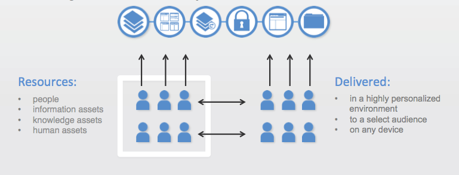

# Covisint Portal Service
The Covisint Portal is a self-service enterprise application platform that lets you quickly build and deploy websites and applications to deliver the right information, in the right way, at the right time, to the right people.  The Portal drives meaningful interaction and collaboration between people and information assets, knowledge assets and human assets by a select audience, and delivers information from anywhere to the right people, in the right context, on any device.     

What’s more, you can extend your business and your applications onto the platform.  Covisint offers multiple options to rapidly develop applications on the platform or integrate existing applications using the Module Communication Framework.  Extend your business’ reach with Covisint’s application storefront and marketplace capabilities.
The Covisint Portal includes an integrated set of technologies to provide interaction between a user and a set of applications, processes, content, services or other users.  It includes set of mash-up tools, content management, search, rich Internet application (RIA) tools, analytics, collaboration, social and mobile tools.
Secured by industry-leading identity & management capabilities, our dynamic user experience platform provides the interoperability and governance framework that empowers end-users to share knowledge and collaborate with each other across the enterprise. And it enables your organization to be completely secure and flexible, even as your workforce, IT environment, partner relationships and business strategies evolve.

