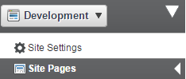
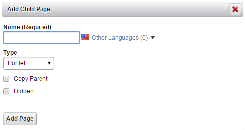

# Managing Pages
An unlimited number of web pages can be created in the portal.
Page Types:
* Public Pages – Public pages can be exposed to unauthenticated users (Guest) or authenticated users; Public pages can be secured by role/service package if required.
* Private Pages – Private pages can only be seen by users with at least one Site role.
* User Pages – Users can enable private pages and public pages as part of their profile that can include all of the Social Network portlets

## Site Pages
Each Site has its own set of pages, public and private.  Pages can be individually styled with one of the available page layouts, a unique theme, CSS, and JavaScript.
For purposes of this Beta release, public pages are used for all of the content.  Pages may all share a common look and feel or can be independently styled.  When using the dynamic theme, only one dynamic theme can be paired with a user, and only set of dynamic theme settings can be used in a particular site.  Manual CSS and JavaScript can be applied to a site.

When using the dynamic theme, only one dynamic theme can be paired with a user, and only set of dynamic theme settings can be used in a particular site.  Manual CSS and JavaScript can be applied to a site.

## Page Layout
A predefined page format that governs the orientation of portlets on a page.  Page Templates can be used to control which sections of a page can be customized by end users

## Create Site Pages
Steps:
1. Log in to portal as a content administrator.
2. Adding and manipulating pages requires Edit Controls to be enabled.  Check the box in the dock bar.
 * Note that the dockbar only appears if a user has the ability to perform the functions on the dockbar in the context of the page the user is viewing
3. On the dockbar, click **Manage**, then select **Site Pages**.    

4. If you want to add a Top Level Page, click **AddPage**
    * If you want to add a sub page, first click on the page that will be the parent page, then click Add Child Page.  

5. Type a name for the page, select Portlet as the page Type (a Portlet page is a page on which you can add portlets).
    * If you check the box for Copy Parent, it will copy the page layout and portlets, but NOT any content displayed in portlets or portlet configurations.  There is a separate way to make an exact copy of a page displayed below
    * Checking the box for Hidden will suppress a page from Navigation, but the page will still be visible in Search.     

6. Click on the name of your new page
    * If you want to copy an existing page, click Copy Portlets from Page, select the page and click Copy
        1. Not that this will make an exact copy of the source page but it does NOT duplicate content.
        2. This means that if a web content article is displayed on the source page, the SAME article is being displayed on the new page; these are two views of the same article.
        3. If you want to modify one of the web content articles on the page, you will need to create a new article by copying the article content.
        4. If you change the web content article on one page, it is only one article, so it will be changed everywhere
7. You can make changes to the page in a couple of areas
 * You can modify the look of the page and add custom CSS  on the Look and Feel tab.
 * You can change the layout on the Page tab.
 * You can add custom JavaScript to the page on the JavaScript tab.
 * The other tabs, including mobile rule groups are more advanced settings and should be covered separately.
8. You can change the page order by dragging and dropping the pages in the list of pages.
9. When you have finished making changes, click **Save**.

## Add Content to a Page
### Steps:
1.
