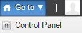
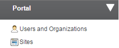
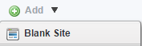
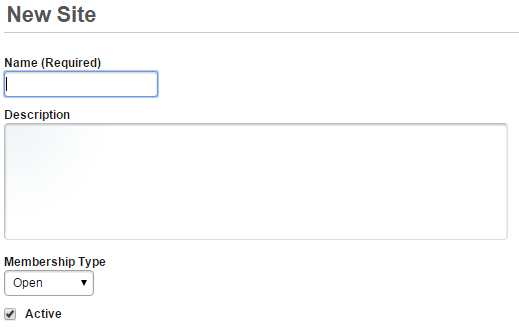

# Managing Sites
Sites are the basic unit for creating content in the content management system.  Each site has a discrete set of assets (pages, documents, etc.) that are managed by a set of site roles that can be granted to users for that site.  When using sites, it's important to understand the basic concepts:

## Organization
An Organization is the portal construct for giving a hierarchical structure to sites affiliated with companies

## Site
A site is the basic unit for content management and collaboration.

### Site Types
* Open – Users can join or leave sites without any approval required.
* Restricted – Users request access to sites and access is granted by a Site administrator
* Private – Users can access Private Sites by invitation only – NOTE that sites in the POC are all built as Private Sites

### Site Content
Each site has an independent set of content:
* Web Content
* Documents and Media
* Blog
* Wiki
* Forum
* Knowledge Base
* Local taxonomy
* Site Pages

### Site Roles
Each Site has an independent set of users that can be granted granular access to Site content.
* Site Administrator – Site administrator is a standard role across all sites that has omni-administrative privileges for a Site, including content administration, page and site administration, and user access administration
* Site Member – Site member is a standard role across all sites with basic access to authenticated site content
* Site Teams – Site Teams are ad hoc roles that can be created on an individual site

### Site Template
A generic site construct including pages, content and permissions from which new Sites can be created

## Web Content Article
A single piece of HTML content that can be displayed on one or more pages that can be created using a Web Content Template or the WYSIWYG editor.

## Web Content Structure
A portal construct that is used to store form-based data to build Web Content Articles using Templates.

## Web Content Template
A portal construct that is used to automatically display a Web Content article.

## Asset Publisher
A portlet that displays content dynamically based on site repository, asset type, categorization etc. with multiple display styles.

## Create a site
### Steps:
1. Click the **Go to** menu and select **Control Panel**.

2. On the left side, under Portal section, click **Sites**.

3. Click the **Add** menu and select **Blank Site**.

4. Enter the site name, and the description. Select **Open**, and check **Active**. Then, click **Save** to save the site.

### Result
You have successfully created a new site

