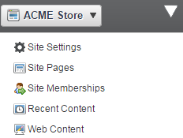
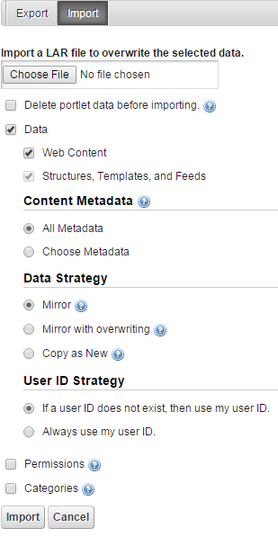

# Publishing Content
This section illustrates how to add a portlet, and other types of content. You can upload three types of contents via a LAR file 1) Web Content 2) Documents and Media, and 3) Entire Site. Be careful not to confuse portlet-specific .lar files with site-specific .lar files.

## Adding a Portlet
Users can be granted different roles that have the ability to place one or more portlets on a page.  In addition, Pages can be configured so that specific roles can only place portlets on a specific section of a page.  We also have the ability to add preconfigured portlets to a library, from which the portlets can be dropped on a page.

## Upload Web Content
You can upload the web content via a LAR file.
### Steps:
1. Log in to your site as a Portal Administrator.
2. Under your site section, click **Web Content**.

3. On the right corner, click and select **Export/Import**.

4. Click the **Import** tab, select **Choose File** to select the desired LAR file. Then, click    **Import**.

5. You have successfully imported the Web Content.

## Upload Documents and Media
You can upload documents and media via a LAR file.
### Steps:

## Upload Entire Site

## Upload a Portlet
