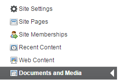
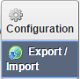
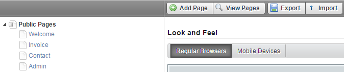
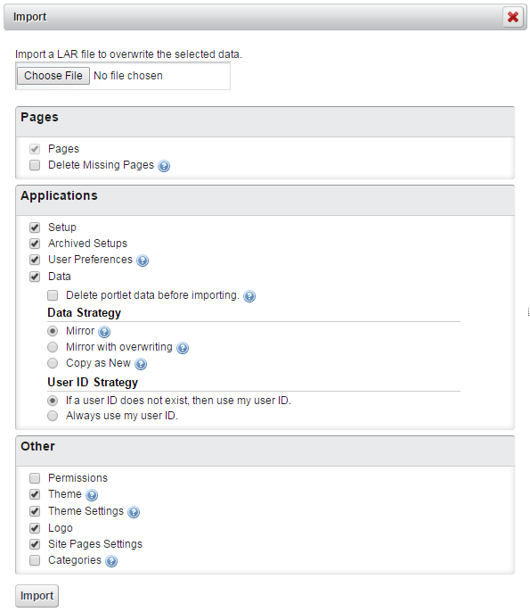
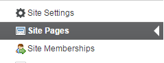
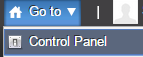
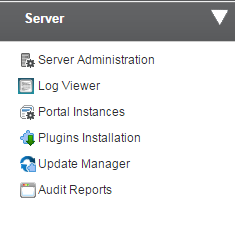
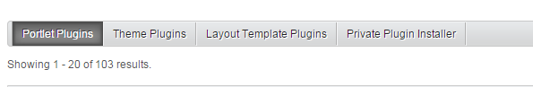
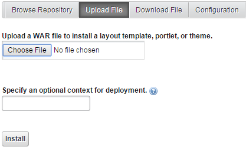

# Publishing Content
This section illustrates how to add a portlet, and other types of content. You can upload three types of contents via a LAR file 1) Web Content 2) Documents and Media, and 3) Entire Site. Be careful not to confuse portlet-specific .lar files with site-specific .lar files.

## Adding a Portlet
Users can be granted different roles that have the ability to place one or more portlets on a page.  In addition, Pages can be configured so that specific roles can only place portlets on a specific section of a page.  We also have the ability to add preconfigured portlets to a library, from which the portlets can be dropped on a page.
### Steps:
1. Log into portal as a content administrator.
2. Adding and manipulating portlets requires Edit Controls to be enabled.  Check the box in the dock bar.
    * Note that the dockbar only appears if a user has the ability to perform the functions on the dockbar in the context of the page the user is viewing
3. On the dockbar, click **Add**.
4. If the portlet you want to add is on the list, add it to the page.
5. If it is not on the list, click **more**.
6. When the add portlets modal appears, type the first few letters of the portlet in the search field.
7. There are two ways to add the portlet to the page:
    * Click the **Add** button; this will add the portlet to the page in the top left most  position.
    * Drag and drop the portlet on a page.
8. Some portlets are unique application portlets that can only be added once to a page (Ex. Documents and Media).
9. Most portlets are instanceable, meaning that they can be added more than once on any page (Ex. Asset Publisher, Web Content Display).
10. When a portlet is added to a page, it can be added to any pane in a page layout
    * A user must have the permission to add a portlet to a pane
    * If a user has the abiltity to add portlets, the default is to be able to add a portlet anywhere on a page.
11. A portlet will size to 100% of the width of a pane in a page layout and will to 100% of the portlet height.
12. Portlet borders can be enabled and disabled.
13. Portlets can have custom titles; Titles can be edited by clicking on them.
14. Modifying the permissions to a portlet as defined in the "Controlling Access to and Audience for Content" section.

## Upload Web Content
You can upload the web content via a LAR file.
### Steps:
1. Log in to your site as a Portal Administrator.
2. Under your site section, click **Web Content**.  

3. On the right corner, click and select **Export/Import**.  

4. Click the **Import** tab, select **Choose File** to select the desired LAR file. Then, click **Import**.  

5. You have successfully imported the Web Content.

## Upload Documents and Media
You can upload documents and media via a LAR file.
### Steps:
1. Log in to your site as a Portal Administrator.
2. Under your site section, click **Documents and Media**.  

3. On the right corner, click  and select **Export/Import**.  

4. Click **Public Pages** and then click **Import**.  

5. Choose the LAR file and then click **Import**.  

6. Click the Import tab, select **Choose File** to select the desired LAR file. Then, click **Import**.  

7. You have successfully imported documents and media.

## Upload Entire Site
You can upload the entire site via a LAR file.
### Steps:
1.	Log in to your site as a Portal Administrator.
2.	Under your site section, click **Web Content**.  

3.	On the right corner, click  and select **Export/Import**.  

4.	Click the Import tab, select **Choose File** to select the desired LAR file. Then, click Import.  

5.	You have successfully imported the Web Content.

## Upload a Portlet
This section illustrates how you can import a portlet using the portlet-specific LAR file.
### Steps:
1. Log into the Covisint App Cloud Developer Portal.
2. Click **Go to** and **Control Panel**.

3. Click **Plugins Installation**.    

4. Click **Private Plugin Installer**.    

5. Click **Upload File**, and then choose a WAR file to install a layout template, and click **Install**.    

